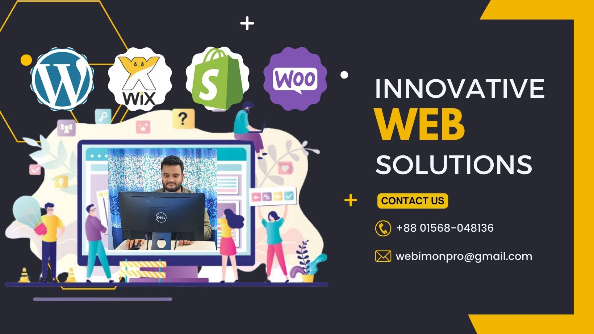

<!-- banner image starts here  -->

<!-- banner image ends here  -->

<h1> Hey! I'm Imon. Nice to see you.</h1>

I am a skilled and imaginative web designer with a proven track record of success. I first understand the client's requirements and try to build his website with CMS (Wordpress, Wix, Webflow, Shopify). If CMS can't fulfil her requiremnt then I build it with custom code (HTML, css, javascript, php). 

Over the years, I have completed numerous projects on esteemed platforms such as Upwork, Fiverr, Freelancer, and Peopleperhour, earning the satisfaction and trust of many clients. **I'm open to work and employment opportunities**.

I love to read books and listen to music.

- :fireworks: I am a level-ii seller in Fiverr Marketplace & Rising talent in UpWork in Web Designer category. 
- 🌱 I’m currently learning many things, I believe that everyday is a learning opportunity.
- 👯 I’m currently open for work and employment opportunities (remote and relocation)
- 💬 Ask me about WordPress, Wix and Shopify.
- 📫 I am just one mail away - [contact at webimon dot com]
- 😄 Pronouns: He, Smiley face & Happy 😄
- :partying_face: Fun fact: I love listen to music, I love to tour and travel worldwide.

### Numbers

### Where to find me

 

