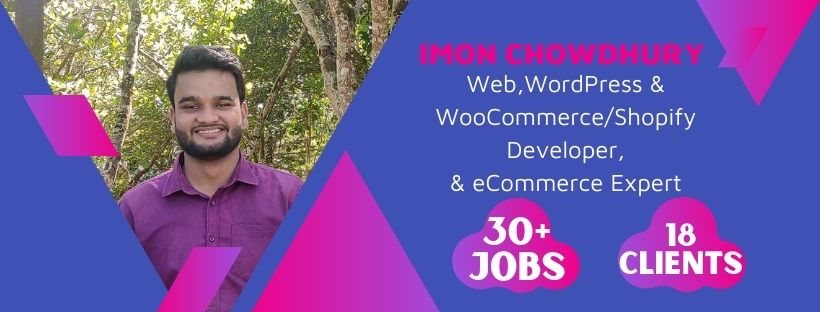
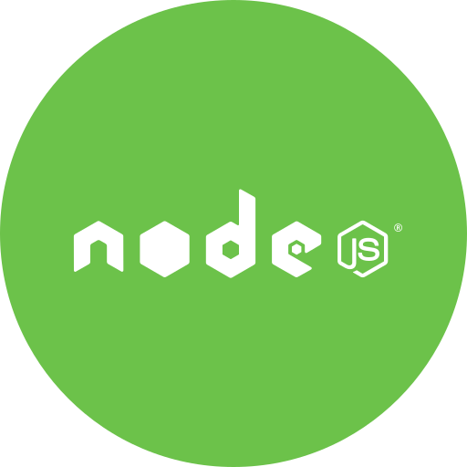

<!-- banner image starts here  -->

<!-- banner image ends here  -->

<h1> 👋 Hello, I'm Imon Chowdhury </h1>

A full time freelancer on & web developer  
🏠 &nbsp; Living: Tampere, Finland

<!-- Contact me section starts here  -->

[][website]
[][youtube]
[][facebook]
[][linkedin]
 
 

<!-- Contact me section ends here  -->

<!-- about-me section starts here  -->

### 👨‍🏫 &nbsp; About Me

I am a professional web designer & developer. I have been working with WordPress, Ecommerce, & Shopify for the last three years. I have build more over 150+ live websites for my international clients.
After completing my becholors degree. I am spending much time
improving my web development skills. Every day I want to learn something new and share my knowledge with
my comunity.

 
<!-- about-me section ends here  -->

<!-- web related skills section starts here  -->

### 👨🏽‍💻 &nbsp; My Skills:

#### Key Skills & Videos on Web development:

[]
[]
[]
[]
[]
[]
[]
[]
[]
[]
[]
[]

 
 
 

<!-- web related skills section ends here  -->
<!-- other skills and my videos for computer science section starts here  -->

#### Other Skills:

[]
[]
[]
[]
[]

 
 
 

- [Artificial Intelligence (English)]
- [Artificial Intelligence (Bangla)]
- [Java Swing]
- [Discrte Math]
- [Numerical Method]
- [Theory of computation]
- [Compiler]
- [Networking]
- [Operating System]
- [Learn for skill]
- [MS Word]
- [MS Excel]
- [MS powerpoint]
  <!-- other skills and my videos for computer science section ends here  -->

   

<!-- github stats starts here  -->

<!--  -->

 

<!-- github stats ends here  -->
  

<!-- other skills and my videos for computer science section starts here  -->

<!-- work experience section starts here  -->

### 💼 &nbsp; Employment History

| Position            | Institute                                   | Duration            | Location           |
| ------------------- | ------------------------------------------- | ------------------- | ------------------ |
| Courier (Part-time) | Posti Oy                                    | Oct 2019- Running   | Tampere, Finland   |
| Research Assistant  | Tampere University                          | Nov 2020 - Jan 2021 | Tampere, Finland   |
| Lecturer of ICT     | Jaflong Valley Boarding School              | Jul 2018 – Nov 2018 | Sylhet, Bangladesh |
| Guest Lecturer      | Sylhet Engineering College                  | Nov 2017 – Apr 2018 | Sylhet, Bangladesh |
| Android developer   | United Computer & Technical Training Center | Nov 2016 – Nov 2017 | Sylhet, Bangladesh |
| Lecturer of ICT     | Zhingabari High School & College            | May 2016 – Aug 2017 | Sylhet, Bangladesh |

 
<!-- work experience section ends here  -->
<!-- education section starts here  -->

### 👨🏻‍🎓 &nbsp; Education

1. B.Sc. in Mechanical Engineering  
   City University  
   Dhaka, Bangladesh.
2. Diploma in Mechanical Engineering  
   Shymoli Ideal Polytechnic  
   Chittagong, Bangladesh.

 

<!-- education section ends here  -->

<!-- my languages section starts here  -->

### Languages:

- 🇧🇩 Bangla : Native
- 🏴󠁧󠁢󠁥󠁮󠁧󠁿 English : Advanced
- 🇮🇳 Hindi : Intermediate

   

<!-- my languages section ends here  -->

<!-- my sports and game section starts here  -->

### Sports / Game / Activities / Hobby:

- 🏏 Cricket, ⚽ Football, 🏸 Badminton, ♟️ Chess, 🏐 Volleyball
- 🏊‍♂️ Swimming, 🏃‍♂️ Running, 🚶‍♂️ Walking
- ✈️ Travelling

 

---

Thanks for going through my Portfolio.
All rights reserved by Imon Chowhdury @2021

---

<!-- my achievement section ends here  -->

<!-- Links section starts here -->

[website]: http://www.imonchowdhury.com/
[youtube]: https://www.youtube.com/channel/UC4cTQ4qHDcWVOE0kdN2aHcw
[facebook]: https://www.facebook.com/webimon/
[linkedin]: https://www.linkedin.com/in/webimon/
[github]: https://github.com/webimon

<!-- Links section ends here -->
